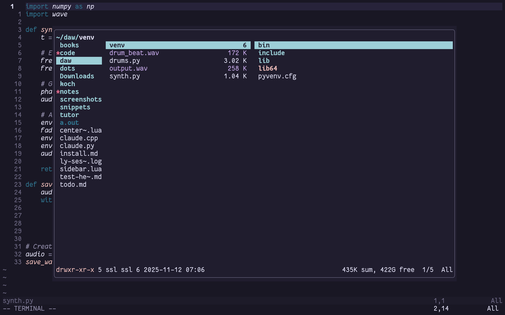

# neoranger.nvim

Ranger file manager in a floating window for Neovim.



## Features

- Opens ranger in a centered floating window
- Smart file opening: opens in current buffer if empty, otherwise in a new tab
- Multi-select: mark several files in ranger and open them all at once
- True toggle: hiding the window keeps ranger running; toggle again to return to the same session
- Starts with the current file highlighted in ranger
- Change working directory to current file location
- No external dependencies (besides ranger itself)

## Requirements

- Neovim >= 0.11.0
- Ranger file manager installed (`sudo apt install ranger` or `brew install ranger`)

Run `:checkhealth neoranger` to verify your setup.

## Install

**lazy.nvim:**
```lua
{
  "stianlyng/neoranger.nvim",
  opts = {},
}
```

**nvim package manager:**
```lua
vim.pack.add({
  { src = "https://github.com/Stianlyng/neoranger.nvim.git" },
})
```

**Manual:**

Auto-load:
```bash
git clone https://github.com/Stianlyng/neoranger.nvim.git ~/.config/nvim/pack/plugins/start/neoranger.nvim
```

Optional-load:
```bash
git clone https://github.com/Stianlyng/neoranger.nvim.git ~/.config/nvim/pack/plugins/opt/neoranger.nvim
```

Then add this in your `init.lua`:
```lua
vim.cmd.packadd('neoranger.nvim')
```

Calling `setup()` is optional — the plugin works out of the box with defaults. Call it only to override configuration.

## Usage

### Commands

`:Neoranger` - Toggles ranger in a floating window (`:NeorangerFloat` is kept as an alias)

```vim
:Neoranger          " Opens in current working directory
:Neoranger ~/path   " Opens in specified directory
```

### API Functions

```lua
local neoranger = require("neoranger")

-- Toggle floating ranger window
neoranger.toggle()                           -- Opens in current working directory
neoranger.toggle({ cwd = "/some/path" })     -- Opens in specific directory
neoranger.toggle({ cwd = vim.fn.expand("%:p:h") })  -- Opens in current file's directory

-- Change Neovim's working directory to current file's directory
neoranger.cdw()

-- Save Neovim servername to a file for external scripts.
-- Note: processes started from :terminal (including ranger itself) already
-- get the servername in the $NVIM environment variable.
neoranger.save_servername()
```

`toggleFloat()` still works as an alias of `toggle()`.

### Keybind Examples

**Basic usage:**
```lua
-- Toggle ranger in current working directory
vim.keymap.set("n", "<leader>rc", function()
  require("neoranger").toggle()
end, { desc = "Open ranger" })

-- Toggle ranger in current file's directory
vim.keymap.set("n", "<leader>rr", function()
  require("neoranger").toggle({ cwd = vim.fn.expand("%:p:h") })
end, { desc = "Ranger in file dir" })
```

**Additional utilities:**
```lua
-- Save servername for external scripts
vim.keymap.set("n", "-", function()
  require("neoranger").save_servername()
end, { desc = "Save nvim servername" })

-- Change working directory to current file
vim.keymap.set("n", "<leader>cd", function()
  require("neoranger").cdw()
end, { desc = "CD to current file" })
```

### Inside Ranger

- **`<Esc>`** (configurable via `close_key`): Hide the floating window — ranger keeps running, toggle again to return to it
- **`q`**: Quit ranger and close the window
- **`l` or `<Enter>` on a file**: Open the selected file
  - If current buffer is empty → Opens in current buffer
  - If current buffer has content → Opens in a new tab
- **Mark files with `<Space>`** and confirm: opens all marked files (first per the rule above, the rest in new tabs)
- Ranger starts with the file you came from highlighted
- All other ranger keybinds work as normal

## Configuration

Customize the plugin by passing options to `setup()`:

```lua
require("neoranger").setup({
  width = 0.8,           -- Percentage of screen width (0.8 = 80%)
  height = 0.8,          -- Percentage of screen height (0.8 = 80%)
  border = "rounded",    -- Border style: "rounded", "single", "double", "solid", "shadow"
  ranger_cmd = "ranger", -- Command to launch ranger (string or list with extra args)
  close_key = "<Esc>",   -- Terminal-mode key that hides the window (false to disable)
  choosefile_path = nil, -- Fixed path for ranger's selection file (default: unique temp file)
  servername_path = "/tmp/nvim_servername", -- Where save_servername() writes the servername
})
```

### Configuration Options

| Option | Type | Default | Description |
|--------|------|---------|-------------|
| `width` | `number` | `0.8` | Floating window width as percentage of screen (0.0-1.0) |
| `height` | `number` | `0.8` | Floating window height as percentage of screen (0.0-1.0) |
| `border` | `string` | `"rounded"` | Border style: `"rounded"`, `"single"`, `"double"`, `"solid"`, `"shadow"` |
| `ranger_cmd` | `string\|string[]` | `"ranger"` | Command to launch ranger; use a list to pass extra arguments |
| `close_key` | `string\|false` | `"<Esc>"` | Terminal-mode key that hides the window; `false` to disable |
| `choosefile_path` | `string?` | `nil` | Path where ranger writes selected files; `nil` uses a unique temp file per session |
| `servername_path` | `string` | `"/tmp/nvim_servername"` | File path where `save_servername()` stores the nvim servername |
